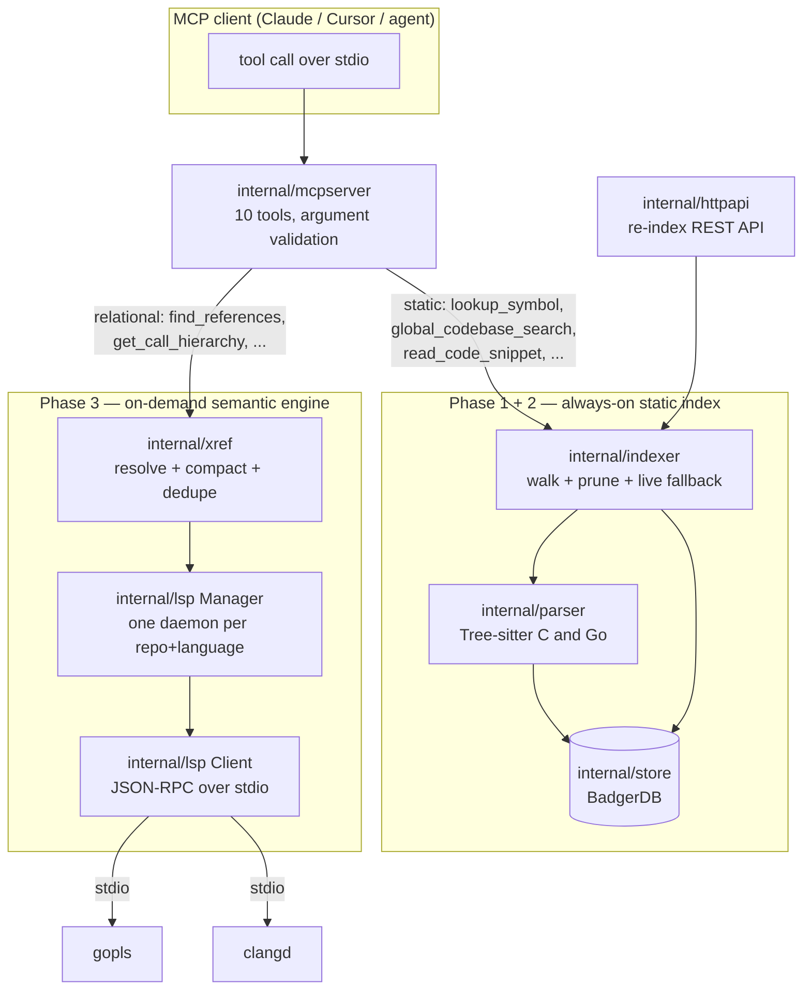

# dotfs-mcp-server

A local-first **Model Context Protocol** server that gives a coding agent a compiler-grade
view of a multi-repository C and Go codebase.

It replaces "grep and hope" with two complementary engines:

| Engine | Question it answers | Cost | Backed by |
| --- | --- | --- | --- |
| **Static index** (Phase 1–2) | *Where is `X` declared? What does it look like?* | sub-millisecond | Tree-sitter → BadgerDB |
| **Cross-reference engine** (Phase 3) | *Who calls `X`? What implements `X`?* | one LSP round trip | `gopls` / `clangd` |

Everything runs on the developer's machine. No source code, no file path outside the
workspace and no telemetry ever leaves the host.

---

## Table of contents

1. [Quick start](#quick-start)
2. [Architecture](#architecture)
3. [Repository layout](#repository-layout)
4. [Data model and key schema](#data-model-and-key-schema)
5. [Tool catalogue](#tool-catalogue)
6. [The cross-reference engine](#the-cross-reference-engine)
7. [Configuration reference](#configuration-reference)
8. [Management HTTP API](#management-http-api)
9. [Development guide](#development-guide)
10. [Design notes and deliberate deviations](#design-notes-and-deliberate-deviations)
11. [Troubleshooting](#troubleshooting)

---

## Quick start

### Prerequisites

| Requirement | Why | Check |
| --- | --- | --- |
| Go 1.26+ | build toolchain (`go 1.26.3` in `go.mod`) | `go version` |
| A C compiler (gcc/clang) | **cgo is mandatory** — the C parser links the Tree-sitter grammar | `gcc --version` |
| `gopls` *(optional)* | relational tools for Go repositories | `gopls version` |
| `clangd` + `compile_commands.json` *(optional)* | relational tools for C repositories | `clangd --version` |

Without the language servers the binary still boots and the six static tools work; only the
four relational tools return an actionable "not installed" error.

### Build and run

```bash
git clone <this repo> && cd dotfs-mcp-server
make build                      # -> bin/dotfs-mcp-server (CGO_ENABLED=1)

DOTFS_WORKSPACE_ROOT=/path/to/workspace \
DOTFS_CACHE_DB=./agent_knowledge \
./bin/dotfs-mcp-server
```

The workspace root is a directory holding **one sub-directory per repository**:

```
/path/to/workspace
├── auth-service-go/      <- repo_name "auth-service-go"
│   ├── go.mod            <- required for gopls
│   └── *.go
└── packet-router-c/      <- repo_name "packet-router-c"
    ├── compile_commands.json   <- required for clangd
    └── *.c, *.h
```

On boot the server walks the workspace, parses every `.go`/`.c`/`.h` file and writes the
symbol index to BadgerDB. Progress is logged to **stderr**; stdout is reserved for the MCP
JSON-RPC stream.

### Wire it to an MCP client

```jsonc
// claude_desktop_config.json / cursor mcp.json
{
  "mcpServers": {
    "dotfs": {
      "command": "/abs/path/to/bin/dotfs-mcp-server",
      "env": {
        "DOTFS_WORKSPACE_ROOT": "/abs/path/to/workspace",
        "DOTFS_CACHE_DB": "/abs/path/to/agent_knowledge",
        "DOTFS_HTTP_ENABLED": "false",
        "PATH": "/usr/local/bin:/usr/bin:/bin:/home/you/go/bin"
      }
    }
  }
}
```

> `PATH` matters: the server resolves `gopls` and `clangd` through it, and MCP clients
> usually launch with a minimal environment.

### Smoke test without a client

```bash
printf '%s\n' \
 '{"jsonrpc":"2.0","id":1,"method":"initialize","params":{"protocolVersion":"2024-11-05","capabilities":{},"clientInfo":{"name":"cli","version":"1"}}}' \
 '{"jsonrpc":"2.0","method":"notifications/initialized"}' \
 '{"jsonrpc":"2.0","id":2,"method":"tools/list","params":{}}' \
 '{"jsonrpc":"2.0","id":3,"method":"tools/call","params":{"name":"lookup_symbol","arguments":{"name":"Session"}}}' \
 | DOTFS_WORKSPACE_ROOT=./testdata/workspace DOTFS_CACHE_DB=/tmp/dotfs-cache \
   DOTFS_HTTP_ENABLED=false ./bin/dotfs-mcp-server
```

---

## Architecture

### The three phases



### Query routing

The agent is expected to walk down this ladder; the tool descriptions push it in the same
direction:

1. **`lookup_symbol` / `global_codebase_search`** — name → declaration. Answered from
   BadgerDB in microseconds. This is where 80 % of questions should end.
2. **`read_code_snippet`** — verify surrounding context, at most 200 lines per call.
3. **Relational tools** — only once a concrete `file:line:character` is known, because
   LSP is position-based. A cold daemon costs seconds; a warm one costs milliseconds.

### Lifecycle

```
boot ──▶ config.Load ──▶ store.Open ──▶ (optional) full index
                                   └──▶ lsp.NewManager   (spawns nothing)
                                   └──▶ xref.New
                                   └──▶ mcpserver.New ──▶ stdio.Listen
                                   └──▶ httpapi.Serve (127.0.0.1:8080)

first relational call for repo R ──▶ Manager spawns gopls/clangd in R, initialize handshake
later calls for repo R          ──▶ reuse the warm session
daemon dies                     ──▶ transparently respawned on the next call
SIGINT/SIGTERM or stdin EOF     ──▶ graceful shutdown → exit → SIGTERM → SIGKILL after 2 s
```

Daemons are **never** started at boot. A workspace with fifty repositories starts as fast as
one with a single repository, and pays for a language server only when the agent actually
asks a relational question.

---

## Repository layout

```
cmd/main.go                  wiring: config → store → indexer → lsp → xref → mcp + http
internal/
  model/                     SymbolRecord, the closed SymbolType enum, validation
  parser/                    Tree-sitter extraction
    parser.go                language dispatch, file size guard
    golang.go                Go: func, method, struct, interface, const, var, type alias
    clang.go                 C: function, struct, union, enum, typedef, #define
  store/                     BadgerDB persistence, key schema, prefix scans, pruning
  indexer/
    indexer.go               walk, incremental prune, live fallback search, snippets
    paths.go                 repo-name validation and traversal-safe path joining
  capabilities/              curated repository capability matrix (JSON)
  httpapi/                   management REST API + single-flight job registry
  mcpserver/
    server.go                the six static tools
    xref_tools.go            the four relational tools + the error/fallback matrix
  lsp/                       Phase 3 transport
    protocol.go              LSP types, URI ↔ path conversion
    jsonrpc.go               Content-Length framing, request/response multiplexing
    client.go                one daemon: supervise, dispatch, cancel, shutdown
    manager.go               daemon pool, prerequisite checks, single-flight cold start
    process_{unix,windows}.go  process-group isolation and tree termination
  xref/                      Phase 3 semantics
    service.go               position → session → LSP call → result
    compact.go               dedupe, snippet extraction, path elision
    types.go                 the wire shapes returned to the model
testdata/workspace/          two fixture repositories used by every test
```

**Dependency direction** is strictly one-way: `mcpserver → xref → lsp` and
`mcpserver → indexer → parser/store → model`. Nothing in `lsp` knows about MCP; nothing in
`parser` knows about storage. `xref` depends on `lsp` only through the two-method
`Provider`/`Session` interfaces, which is what makes the whole engine testable without a
language server installed.

---

## Data model and key schema

Every extracted declaration is a `model.SymbolRecord`:

```go
type SymbolRecord struct {
    RepoName      string      `json:"repo_name"`
    FilePath      string      `json:"file_path"`      // repository-relative, slash separated
    Language      Language    `json:"language"`       // "c" | "go"
    SymbolType    SymbolType  `json:"symbol_type"`    // closed enum, see below
    Name          string      `json:"name"`
    Aliases       []string    `json:"aliases"`        // e.g. a typedef'd struct tag
    ParentScope   string      `json:"parent_scope"`   // receiver type or enclosing struct
    StartByte     int         `json:"start_byte"`
    EndByte       int         `json:"end_byte"`
    StartLine     int         `json:"start_line"`     // 1-based, inclusive
    EndLine       int         `json:"end_line"`
    Documentation string      `json:"documentation"`  // comment markers stripped
    Signature     string      `json:"signature"`
    SourceCode    string      `json:"source_code"`    // capped at 200 lines
}
```

`SymbolType` is a closed enum — `function`, `method`, `struct`, `interface`, `macro`,
`macro_function`, `enum`, `typedef`, `constant`, `type_alias` — so the agent can filter
without guessing string values.

### BadgerDB keys

| Key | Purpose |
| --- | --- |
| `sym:<repo>:<file>:<type>:<name>:<%08d start_byte>` | primary record (JSON value) |
| `idx:name:<name>:<repo>:<file>:<%08d>` | name and name-prefix lookup |
| `idx:type:<type>:<name>:<repo>:<file>:<%08d>` | type-filtered lookup |
| `idx:file:<repo>:<file>:<%08d>` | per-file listing and incremental pruning |

`:` inside any variable component is escaped to `%3A`, and byte offsets are zero-padded to
eight characters so keys sort lexicographically inside the LSM tree. Index entries store the
**primary key** as their value, so a lookup is one prefix scan plus one point read — never a
full-record scan.

Re-indexing a repository is incremental: records for files that no longer exist (or whose
symbols disappeared) are pruned by prefix, so the store never accumulates ghosts.

---

## Tool catalogue

Ten tools. The last four are registered **only** when the cross-reference engine is enabled
and constructed, so a client never sees a tool that cannot work.

### Static tools (always available)

| Tool | Required | Optional | Returns |
| --- | --- | --- | --- |
| `lookup_symbol` | `name` | `repo_name`, `symbol_type` | any indexed declaration; exact match first, then prefix |
| `global_codebase_search` | `target_function_name` | — | function/method records across every repository |
| `get_type_definition` | `type_name` | `repo_name` | struct/union/interface/enum/typedef layout with tags and field comments |
| `lookup_macro_or_const` | `name` | `repo_name` | `#define`, enum constant or Go `const`, with the whole `iota`/enum block |
| `read_code_snippet` | `repo_name`, `file_path`, `start_line`, `end_line` | — | line-numbered slice, max 200 lines |
| `list_repo_capabilities` | `repo_name` | — | curated capability matrix + observed structural footprint |

### Relational tools (require a language server)

| Tool | Required | Optional | Returns |
| --- | --- | --- | --- |
| `find_references` | `repo_name`, `file_path`, `line`, `character` | `include_declaration` | every call site / usage, deduplicated per file+line |
| `get_call_hierarchy` | + `direction` (`incoming`\|`outgoing`) | — | callers with their exact call sites, or callees with their definitions |
| `find_interface_implementations` | `repo_name`, `file_path`, `line`, `character` | — | concrete types satisfying an interface |
| `get_type_hierarchy` | `repo_name`, `file_path`, `line`, `character` | `direction` (`supertypes`\|`subtypes`\|`both`) | declaration site plus super/subtypes |

`line` and `character` are **1-based** — the same coordinates the static tools return and the
same ones a human reads in an editor. They are converted to LSP's 0-based positions at the
boundary.

### Examples

```jsonc
// 1. name -> declaration (static, microseconds)
{"name": "lookup_symbol", "arguments": {"name": "SessionState", "symbol_type": "typedef"}}

// 2. who touches it? (relational, needs a position)
{"name": "find_references", "arguments": {
  "repo_name": "auth-service-go", "file_path": "types.go", "line": 6, "character": 6}}
```

```json
{
  "symbol": "SessionState",
  "repo": "auth-service-go",
  "file_path": "types.go",
  "total_references": 2,
  "references": [
    {"repo": "auth-service-go", "file_path": "types.go", "line": 11, "character": 16,
     "snippet": "StatusPending SessionState = iota"},
    {"repo": "auth-service-go", "file_path": "types.go", "line": 31, "character": 10,
     "snippet": "State   SessionState  `json:\"state\"`"}
  ]
}
```

```json
// get_call_hierarchy, direction "outgoing"
{
  "symbol": "ValidateSessionToken",
  "direction": "outgoing",
  "total_callees": 1,
  "calls": [
    {"callee_name": "New", "repo": "(external)", "file_path": ".../src/errors/errors.go",
     "line": 64, "snippet": "func New(text string) error {"}
  ]
}
```

Relational payloads are emitted as **minified** JSON (no indentation) and capped at
**20 results**, with `total_*` reporting the pre-truncation count and `truncated: true` when
the ceiling bites. An empty answer always carries a `hint` steering the agent back to
`lookup_symbol` or `global_codebase_search`.

---

## The cross-reference engine

### Daemon lifecycle

* **One daemon per `(repository, language)`.** Keyed `<repo>|<language>` in `lsp.Manager`.
* **Lazy.** The first relational call for a repository pays the cold start
  (`DOTFS_LSP_INIT_TIMEOUT`, default 45 s); every later call reuses the warm session.
* **Single-flight.** Concurrent tool calls that all miss the cache share one cold start
  instead of launching N servers and discarding N−1.
* **Self-healing.** A dead daemon is detected via its supervisor goroutine and respawned on
  the next request; in-flight calls are released with `ErrDaemonExited` rather than hanging.
* **Isolated.** Each server runs in its own process group and is terminated as a tree
  (graceful `shutdown`/`exit`, then stdin close, then `SIGTERM`, then `SIGKILL` after 2 s),
  so no orphan `gopls` survives the MCP session.
* **Bounded.** Every request runs under `DOTFS_LSP_TIMEOUT` (default 5 s) and a timeout
  sends `$/cancelRequest` so the daemon stops working on an abandoned query.

### Prerequisites per language

| Language | Server | Precondition | If missing |
| --- | --- | --- | --- |
| Go | `gopls` | a `go.mod` at or above the file | `ErrNoGoModule` |
| C / C++ | `clangd` | a `compile_commands.json` in the repo or a `build/` sub-directory | `ErrNoCompileCommands` |

Generate a compilation database with either:

```bash
cmake -S . -B build -DCMAKE_EXPORT_COMPILE_COMMANDS=ON   # then link/copy build/compile_commands.json
bear -- make                                             # for plain Makefile projects
```

### Error and fallback matrix

Every failure is returned as an MCP tool error whose text tells the agent what to do next —
never a bare stack trace.

| Condition | Message theme | Suggested fallback |
| --- | --- | --- |
| request exceeded the deadline | *Tool execution timeout* | retry once, or use the static index |
| no `compile_commands.json` | how to generate one with CMake/bear | `lookup_symbol` |
| no `go.mod` | the repository is not a Go module | `lookup_symbol` |
| `gopls`/`clangd` not on `PATH` | how to install or pin it | static tools still work |
| unsupported file extension | only `.go`, `.c/.h`, C++ are handled | `lookup_symbol` |
| daemon crashed mid-request | the server crashed, retry | retry, then static tools |
| engine disabled or shut down | the engine is not running | static tools |

### Performance envelope

| Operation | Target |
| --- | --- |
| static lookup (`lookup_symbol`) | < 1 ms |
| warm relational call | tens of ms |
| cold start, medium repository | 1–10 s (once) |
| any relational call | hard-capped at `DOTFS_LSP_TIMEOUT` |

---

## Configuration reference

Everything is an environment variable, so the same binary works under an MCP client, systemd
or a container.

### Core

| Variable | Default | Meaning |
| --- | --- | --- |
| `DOTFS_WORKSPACE_ROOT` | `./workspace` | parent directory of the repositories |
| `DOTFS_CACHE_DB` | `./agent_knowledge` | BadgerDB directory |
| `DOTFS_INDEX_ON_START` | `true` | full index during boot |
| `DOTFS_MAX_FILE_SIZE` | `2097152` (2 MiB) | skip source files larger than this |
| `DOTFS_SKIP_DIRS` | `.git,.svn,.hg,node_modules,vendor,third_party,build,dist,out,.idea,.vscode` | pruned during the walk |
| `DOTFS_GC_INTERVAL` | `10m` | BadgerDB value-log GC cadence |
| `DOTFS_CAPABILITIES_FILE` | *(unset)* | JSON repository capability matrix |
| `DOTFS_LOG_LEVEL` | `info` | `debug`, `info`, `warn`, `error` (always to stderr) |
| `DOTFS_SERVER_NAME` / `DOTFS_SERVER_VERSION` | `dotfs-mcp-server` / `1.0.0` | announced in the MCP handshake |

### Management API

| Variable | Default | Meaning |
| --- | --- | --- |
| `DOTFS_HTTP_ENABLED` | `true` | expose the REST API |
| `DOTFS_HTTP_ADDR` | `127.0.0.1:8080` | listen address (loopback by default) |
| `DOTFS_API_TOKEN` | *(unset)* | when set, `Authorization: Bearer <token>` is required |

### Cross-reference engine

| Variable | Default | Meaning |
| --- | --- | --- |
| `DOTFS_LSP_ENABLED` | `true` | when `false`, the four relational tools are not registered at all |
| `DOTFS_GOPLS_PATH` | `gopls` | executable name resolved via `PATH`, or an absolute path |
| `DOTFS_CLANGD_PATH` | `clangd` | executable name or absolute path |
| `DOTFS_CLANGD_ARGS` | *(empty)* | comma-separated extra flags appended to the clangd command line |
| `DOTFS_LSP_TIMEOUT` | `5s` | per-request ceiling |
| `DOTFS_LSP_INIT_TIMEOUT` | `45s` | cold-start handshake ceiling |

---

## Management HTTP API

Bound to loopback by default. Intended for CI hooks and post-`git pull` triggers.

| Endpoint | Description |
| --- | --- |
| `POST /api/v1/{repo_name}/update` | re-index one repository asynchronously; `202` with a job id, `409` if a cycle is already running, `404` if the repository is not in the workspace |
| `GET /api/v1/repos` | indexed repositories with their symbol counts |
| `GET /healthz` | liveness probe |

```bash
curl -X POST -H "Authorization: Bearer $DOTFS_API_TOKEN" \
     http://127.0.0.1:8080/api/v1/auth-service-go/update
```

Concurrent updates of the same repository are rejected rather than queued, so a webhook storm
cannot fork a hundred indexing goroutines.

---

## Development guide

```bash
make fmt      # gofmt -l -w .
make vet      # go vet ./...
make test     # go test ./...
make race     # go test -race ./...
make build    # bin/dotfs-mcp-server, trimmed and stripped
make all      # fmt + vet + test + build
```

`CGO_ENABLED=1` is exported by the Makefile and is **not optional**: the C parser links the
Tree-sitter grammar.

### Test strategy

| Package | What is covered | External dependency |
| --- | --- | --- |
| `parser` | symbol extraction for both languages against the fixture repos | none |
| `store` | key schema, prefix scans, pruning, filters | none |
| `indexer` | walk, incremental re-index, live fallback, path safety | none |
| `mcpserver` | tool registration, argument validation, error mapping | none |
| `httpapi` | auth, single-flight jobs, status codes | none |
| `lsp` | framing, multiplexing, cancellation, daemon death, pool behaviour | **none** — the test binary re-executes itself as a fake language server |
| `xref` | dedupe, truncation, path elision, direction handling, fallbacks | **none** — stub `Provider`/`Session` |

No test requires `gopls` or `clangd`. The fake daemon is a compiled stand-in (a re-exec of the
test binary) rather than a shell script, because a shell block-buffers its stdout when it is a
pipe and makes the handshake race.

### Adding a language

1. `internal/model`: add the `Language` constant.
2. `internal/parser`: add `<lang>.go` with the Tree-sitter queries and register the extension
   in `parser.go`. Reuse the existing `SymbolType` enum — do not invent new values.
3. `internal/indexer`: add the extension to the walk filter.
4. `internal/lsp/manager.go`: extend `LanguageFor`, `LanguageID` and `commandFor` with the
   server binary and its prerequisite check (the equivalent of `go.mod` / `compile_commands.json`).
5. Add a fixture repository under `testdata/workspace/` and extend the parser tests.

### Adding a tool

1. Declare it in `internal/mcpserver` with `mcp.NewTool` — a description written for the
   *model* (when to use it, when not to), explicit annotations, and `mcp.Required()` on every
   argument the handler dereferences.
2. Validate every argument before touching the store or the engine; return
   `mcp.NewToolResultError` with a fallback suggestion, never a raw error.
3. Keep the payload compact: minified JSON, capped result count, snippets instead of whole
   files. Tokens are the real budget.
4. Add a handler test asserting both the happy path and each validation branch.

### Debugging

```bash
DOTFS_LOG_LEVEL=debug ./bin/dotfs-mcp-server 2>/tmp/dotfs.log
grep "language server" /tmp/dotfs.log     # spawn / exit / respawn events
```

Never write to stdout from anywhere in the process: it is the MCP JSON-RPC channel. All
logging goes to stderr, including the language servers' own stderr.

---

## Design notes and deliberate deviations

Documented on purpose, so a reviewer does not mistake them for bugs.

1. **Index values hold the primary key** rather than being empty, which turns a lookup into
   one prefix scan plus one point read.
2. **Exported Go package-level `var`s are indexed as `symbol_type: "constant"`.** The enum is
   closed, and an agent looking for `ErrExpired` thinks of it as a constant-like declaration.
3. **Grouped `const`/`enum` members carry the whole block** as `source_code`, because an
   `iota` member is meaningless without its siblings.
4. **`snippet` is the single target line**, trimmed and capped at 240 characters, rather than a
   `[line-1, line+1]` window — it matches the compact-JSON contract and keeps the token cost
   of a 20-result answer bounded.
5. **Out-of-workspace hits** (the Go standard library, a system header) are reported under the
   repository `"(external)"` with an elided `.../a/b/c` path, so absolute host paths never
   reach the model.
6. **Tool inputs are 1-based** line/character and are converted to LSP's 0-based coordinates at
   the boundary; the model never sees two coordinate systems.
7. **Outgoing call edges report the callee's definition site**, while incoming edges report the
   exact call site — that is what each direction is actually useful for.
8. **References are deduplicated per file + line.** Two hits on one line are one fact for a
   reader, and the duplicate would only burn tokens.
9. **A URI without an explicit `file:` scheme is discarded.** Virtual documents and malformed
   URIs must never be turned into a filesystem path.

---

## Troubleshooting

| Symptom | Cause | Fix |
| --- | --- | --- |
| `tools/list` returns 6 tools | `DOTFS_LSP_ENABLED=false`, or the engine failed to construct | check stderr at boot |
| *"The required language server is not installed"* | `gopls`/`clangd` not on the `PATH` seen by the server | set `DOTFS_GOPLS_PATH` / `DOTFS_CLANGD_PATH`, or fix `PATH` in the MCP client config |
| *"no compile_commands.json"* | C repository without a compilation database | `cmake -DCMAKE_EXPORT_COMPILE_COMMANDS=ON` or `bear -- make` |
| Relational calls time out on the first try, work afterwards | cold start exceeded the request deadline | raise `DOTFS_LSP_INIT_TIMEOUT`, retry once |
| `cgo: C compiler not found` | building with `CGO_ENABLED=0` | install gcc/clang and use `make build` |
| The client hangs at startup | something wrote to stdout | logs must go to stderr only |
| Stale symbols after a `git pull` | index not refreshed | `POST /api/v1/{repo}/update`, or restart with `DOTFS_INDEX_ON_START=true` |

---
