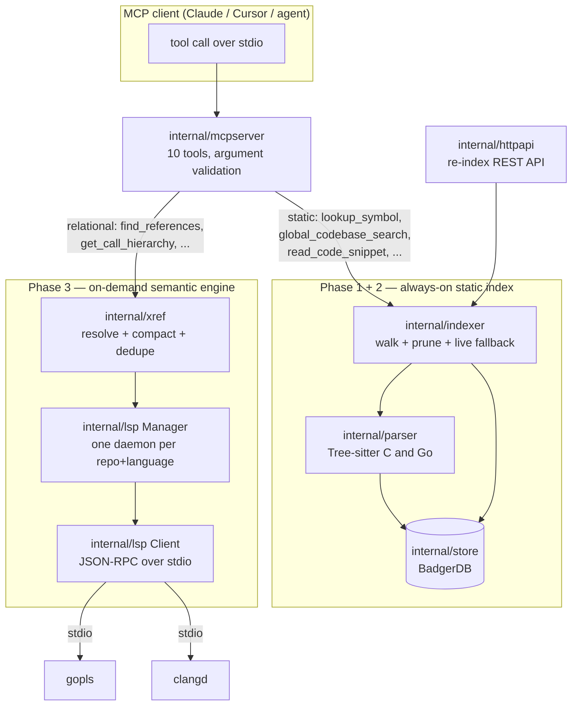

# dotfs-mcp-server

A Model Context Protocol (MCP) server that gives an LLM client surgical,
structural access and compiler-grade view to a multi-repository workspace of **C** and **Go**
microservices — without shell access and without shipping whole files into the
context window.

It replaces "grep and hope" with two complementary engines:

| Engine | Question it answers | Cost | Backed by |
| --- | --- | --- | --- |
| **Static index** (Phase 1–2) | *Where is `X` declared? What does it look like?* | sub-millisecond | Tree-sitter → BadgerDB |
| **Cross-reference engine** (Phase 3) | *Who calls `X`? What implements `X`?* | one LSP round trip | `gopls` / `clangd` |

Everything runs on the developer's machine. No source code, no file path outside the
workspace and no telemetry ever leaves the host.

---

## 1. Architecture

### The three phases



### Query routing

The agent is expected to walk down this ladder; the tool descriptions push it in the same
direction:

1. **`lookup_symbol` / `global_codebase_search`** — name → declaration. Answered from
   BadgerDB in microseconds. This is where 80 % of questions should end.
2. **`read_code_snippet`** — verify surrounding context, at most 200 lines per call.
3. **Relational tools** — only once a concrete `file:line:character` is known, because
   LSP is position-based. A cold daemon costs seconds; a warm one costs milliseconds.

## 2. Configure

### Step 1 — lay out the workspace

`DOTFS_WORKSPACE_ROOT` points at a **parent** directory whose immediate
sub-directories are the repositories. The directory name becomes `repo_name`.

```
.../dotfs-workspace/
├── dotfs/      # repo_name = dotfs
│   └── ...*.go
└── samba/      # repo_name = samba
    └── ...*.c, *.h
```

### Step 2 — set the environment

| Variable | Default | Purpose |
|---|---|---|
| `DOTFS_WORKSPACE_ROOT` | `./workspace` | Parent directory of the repositories |
| `DOTFS_CACHE_DB` | `./agent_knowledge` | BadgerDB directory |
| `DOTFS_HTTP_ADDR` | `127.0.0.1:8080` | Management API listen address |
| `DOTFS_HTTP_ENABLED` | `true` | Set `false` to run stdio-only |
| `DOTFS_API_TOKEN` | *(empty)* | When set, requires `Authorization: Bearer <token>` |
| `DOTFS_INDEX_ON_START` | `true` | Index the whole workspace at boot (async) |
| `DOTFS_MAX_FILE_SIZE` | `2097152` | Skip source files larger than this (bytes) |
| `DOTFS_SKIP_DIRS` | `.git,node_modules,vendor,...` | Comma-separated directory names to prune |
| `DOTFS_GC_INTERVAL` | `10m` | BadgerDB value-log GC cadence |
| `DOTFS_LOG_LEVEL` | `info` | `debug` \| `info` \| `warn` \| `error` |
| `DOTFS_SERVER_NAME` / `DOTFS_SERVER_VERSION` | `dotfs-mcp-server` / `1.0.0` | Advertised during the MCP handshake |
| `DOTFS_LSP_ENABLED` | `true` | Enable the relational engine (gopls/clangd) |
| `DOTFS_LSP_TIMEOUT` | `5s` | Maximum time to wait for a warm LSP response |
| `DOTFS_LSP_INIT_TIMEOUT` | `45s` | Maximum time to wait for a cold LSP response |
| `DOTFS_GOPLS_PATH` | `gopls` | Path to the Go language server |
| `DOTFS_CLANGD_PATH` | `clangd` | Path to the C/C++ language server |
| `DOTFS_CLANGD_ARGS` | None | Extra arguments to clangd |

All logs go to **stderr**; stdout is reserved for the MCP JSON-RPC framing.

### Step 3 — register the server with your LLM client

**Claude Desktop** (`claude_desktop_config.json`):

```json
{
  "mcpServers": {
    "dotfs-codebase": {
      "command": "/opt/dotfs/bin/dotfs-mcp-server",
      "env": {
        "DOTFS_WORKSPACE_ROOT": "/srv/workspace",
        "DOTFS_CACHE_DB": "/var/lib/dotfs/agent_knowledge",
        "DOTFS_HTTP_ADDR": "127.0.0.1:8080",
        "DOTFS_API_TOKEN": "change-me"
      }
    }
  }
}
```

**Cursor** (`.cursor/mcp.json`) and **VS Code** (`.vscode/mcp.json`) use the same
`command` / `env` shape with `"type": "stdio"`.

Restart the client, then confirm that `global_codebase_search` and
`list_repo_capabilities` appear in its tool list.

---

## 5. Tools exposed to the LLM

All six tools are annotated read-only, idempotent and closed-world: the model is
told up front that nothing it calls here can mutate the workspace.

Every lookup follows the same two-tier resolution strategy — an O(1) BadgerDB
read first, and on a miss a live, 30 s-bounded Filter-Then-Parse scan of the
workspace that back-fills the cache. A cold cache therefore degrades latency,
never correctness.

### `global_codebase_search(target_function_name)`

Exact-match lookup restricted to `function` and `method`. Returns the
`SymbolRecord` JSON verbatim — a bare object when the name is unique, an array
when several repositories (or a C header and its `.c` file) declare it.

```json
{"target_function_name": "route_packet"}
```

### `lookup_symbol(name, repo_name?, symbol_type?)`

The general entry point. `name` is a **prefix** match, so `ERR_FSAL` enumerates
an entire error family in one call. Optional `symbol_type` narrows to a single
kind from the taxonomy in §1; optional `repo_name` narrows to one repository.
Results are exact matches first, then prefix matches, capped at 25 records.

```json
{"name": "ERR_FSAL", "symbol_type": "macro", "repo_name": "nfs-ganesha"}
```

### `get_type_definition(type_name, repo_name?)`

Exact-match lookup restricted to `struct`, `interface`, `enum`, `typedef` and
`type_alias`. Use this when the model has seen a type in a signature and needs
its members, not its call sites.

```json
{"type_name": "router_ops"}
```

### `lookup_macro_or_const(name, repo_name?)`

Exact-match lookup restricted to `macro`, `macro_function` and `constant` —
the answer to "what is the numeric value behind this flag?".

```json
{"name": "ROUTER_QUEUE_DEPTH"}
```

### `read_code_snippet(repo_name, file_path, start_line, end_line)`

Bounded, line-numbered escape hatch for the code *between* symbols. `file_path`
is repository-relative, exactly as returned in a `SymbolRecord`. The range is
clamped to **200 lines**; the path is rejected if it is absolute, contains `..`,
or resolves outside the repository after symlink evaluation.

```json
{"repo_name": "packet-router-c", "file_path": "router.c", "start_line": 40, "end_line": 96}
```

```
packet-router-c/router.c:40-96
    40 | int route_packet(const struct router_ops *ops, ...)
    41 | {
```

### `list_repo_capabilities(repo_name)`

Returns a markdown briefing: language stack, business responsibility,
implemented features, integration interfaces and the observed structural
footprint — symbol count, declaration mix by kind, and representative entry
points.

### `find_references(repo_name, file_path, line, character, include_declaration)`

Returns a list of all call sites and references to the symbol at the given
position. `include_declaration` controls whether the declaration itself is
returned in the list.

### `get_call_hierarchy(repo_name, file_path, line, character, direction)`

Returns a tree of all callers or callees of the symbol at the given position.

### `find_interface_implementations(repo_name, file_path, line, character)`

Returns a list of all concrete types that implement the interface at the given
position.

### `get_type_hierarchy(repo_name, file_path, line, character, direction)`

Returns a tree of all subtypes or supertypes of the type at the given position.

---

## 6. Management REST API

| Method | Path | Result |
|---|---|---|
| `POST` | `/api/v1/{repo_name}/update` | `202` job accepted, `409` already indexing, `400` invalid name, `404` unknown repo, `401` bad token |
| `GET` | `/api/v1/repos` | Repositories plus their live indexing state |
| `GET` | `/healthz` | Liveness probe |

```bash
curl -X POST -H "Authorization: Bearer change-me" \
     http://127.0.0.1:8080/api/v1/auth-service-go/update
# {"repo":"auth-service-go","started_at":"...","status":"accepted"}
```

Concurrency control: an in-memory map guarded by a `sync.Mutex` tracks active
repositories. A duplicate request is rejected immediately with `409 Conflict`
instead of queueing, and the execution flag is released by a `defer` once the
worker has flushed its BadgerDB writes. Reads from the LLM are never blocked by
an in-flight cycle.

Wire it to a CI post-merge hook to keep the cache hot without restarts.

---

## 7. How indexing works

**Phase 1 — fast string scan.** Files are read into memory and rejected with
`bytes.Contains` before any AST work: a live search rejects files that lack the
literal symbol, and a full index rejects files that contain no declaration token
for their language at all (`package ` for Go; `(`, `{`, `#define`, `struct`,
`enum` or `typedef` for C).

**Phase 2 — routing-aware AST extraction.** The extension picks the engine:

* `.go` → `parser.ParseFile` with `ParseComments`. `*ast.FuncDecl` yields
  functions and methods (signature truncated at the opening brace);
  `*ast.TypeSpec` yields structs, interfaces, typedefs and type aliases, with
  embedded fields and struct tags summarised into the signature; `*ast.ValueSpec`
  yields constants and exported vars. Every symbol records its exact byte scope
  (`.Pos()`/`.End()`) and its `Doc` comment group, stripped of `//` boilerplate.
  The doc block is deliberately excluded from `source_code`.
* `.c` / `.h` → Tree-sitter. The walk harvests `function_definition`,
  `preproc_def`, `preproc_function_def`, `struct_specifier`, `union_specifier`,
  `enum_specifier`, `type_definition` and bare function prototypes — and nothing
  else, so occurrences inside string literals, `printf` calls or macro bodies
  can never be mistaken for a definition. Contiguous `comment` siblings directly
  above the node become the documentation (a blank line ends the block); the
  search climbs up to three ancestor levels so a comment above `typedef struct`
  still attaches to the specifier nested inside it.

Writes are delta-checked with a SHA-256 fingerprint over every field, so
unchanged symbols cause no disk I/O. After a repository is walked the indexer
holds the set of primary keys it just proved live and prunes every other
`sym:<repo>:` key together with its three index entries — so symbols deleted
from a file, and files deleted from the tree, both disappear in the same pass.
Pruning is scoped to the repository being indexed and batched 512 keys at a time.

---

## 8. Security posture

* No shell execution and no arbitrary file reads: the model receives parsed
  symbol records, plus — through `read_code_snippet` only — a line range capped
  at 200 lines from a file that has been proven to live inside the requested
  repository after symlink resolution.
* `repo_name` is validated against a strict allowlist pattern and re-checked
  after symlink resolution, so it cannot escape the workspace root.
* Symlinked files are never followed during the walk.
* The management API binds to loopback by default and supports a bearer token
  compared in constant time.
* File paths returned to the model are workspace-relative.

---

## 9. Operating notes

* **Cold start:** the initial index runs asynchronously so the MCP handshake is
  never delayed; early lookups fall back to the live scan.
* **Same symbol in two repositories:** keys are namespaced by repository, file
  and byte offset, so nothing is overwritten — every declaration is returned and
  the caller can disambiguate with `repo_name`.
* **Upgrading from Phase 1:** the `func:` / `idx:<repo>:` namespace is gone.
  Delete `DOTFS_CACHE_DB` once; the Phase 2 namespace rebuilds on next boot.
* **Cache reset:** stop the server and delete `DOTFS_CACHE_DB`.
* **Debugging:** `DOTFS_LOG_LEVEL=debug` adds per-file filter decisions and
  BadgerDB internals on stderr.

---

## 10. Tests

```bash
make test     # unit + integration tests
make race     # race detector
```

Coverage includes AST extraction of every symbol kind in both languages
(including the string-literal false-positive case, anonymous `typedef enum`
scope propagation, `iota` const blocks and struct tags), the typed key schema
with its three secondary indexes, cache delta/prune semantics, symbol
invalidation after a file is deleted, snippet clamping and path-traversal
rejection, live fallback search, all six MCP tools and the
`202`/`409`/`401`/`404` behaviour of the sync API.

`testdata/workspace/` holds a two-repository fixture (`packet-router-c`,
`auth-service-go`) that exercises the full taxonomy end to end.

---

## License

See [LICENSE](LICENSE).
